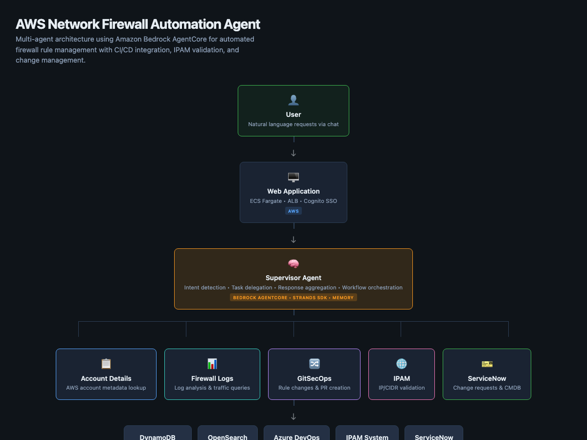
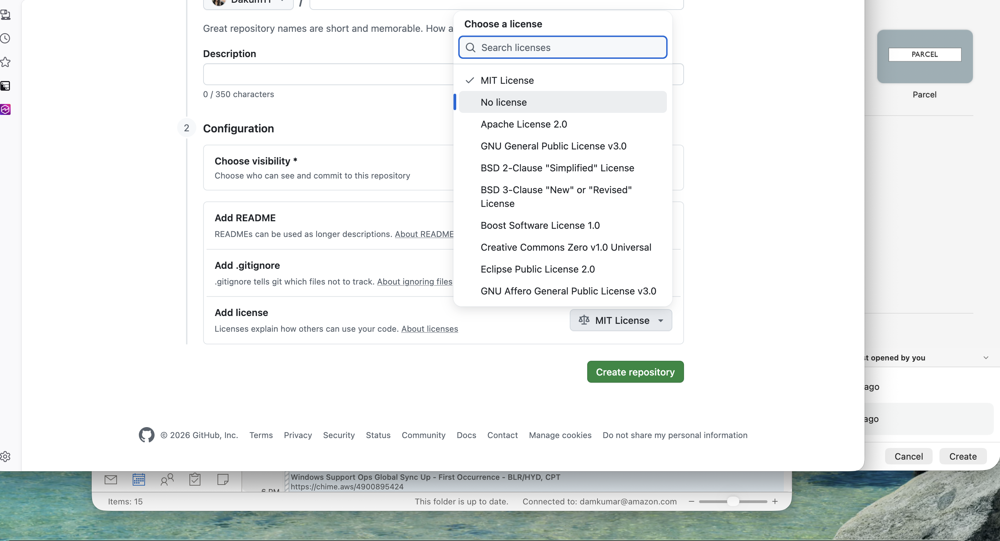

# Guidance for Automated Network Firewall Rule Management using Amazon Bedrock AgentCore on AWS

## Table of Contents

1. [Overview](#overview)
    - [Cost](#cost)
2. [Prerequisites](#prerequisites)
    - [Operating System](#operating-system)
    - [AWS account requirements](#aws-account-requirements)
    - [Service quotas](#service-quotas)
    - [Supported Regions](#supported-regions)
3. [Deployment Steps](#deployment-steps)
4. [Deployment Validation](#deployment-validation)
5. [Running the Guidance](#running-the-guidance)
6. [Next Steps](#next-steps)
7. [Cleanup](#cleanup)

## Overview

This Guidance demonstrates how to build and deploy a multi-agent system that automates AWS Network Firewall rule management using Amazon Bedrock AgentCore and the Strands Agents SDK. Five specialist agents collaborate to validate, author, and deploy firewall rule changes through natural language — removing manual toil while preserving approval gates.

**Why did we build this Guidance?** Managing AWS Network Firewall rules at scale requires specialized knowledge of Suricata rule syntax, IP address management, Git workflows, and change management processes. This Guidance solves the problem of manual, error-prone firewall rule authoring by orchestrating multiple AI agents that each handle a specific domain.

**What problem does this Guidance solve?**

- Eliminates manual Suricata rule authoring — natural-language requests are translated into validated rules, reducing misconfiguration risk
- Automates the end-to-end workflow from request through IP validation, rule generation, Git commit, PR creation, and change ticketing
- Provides multi-agent specialization so each domain (account context, log analysis, IPAM, Git, ITSM) is handled by a purpose-built agent
- Preserves approval gates — automation handles everything *except* the human approval step, keeping change control intact



### Architecture Flow

1. **User Interface**: Web application hosted on Amazon ECS Fargate behind an Application Load Balancer, with authentication through Amazon Cognito federated with Azure AD
2. **API Layer**: Amazon Bedrock AgentCore `InvokeAgentRuntime` API provides streaming chat interactions between the UI and the agent
3. **Supervisor Agent**: Central orchestrator built with Strands Agents SDK running on Bedrock AgentCore, using Claude Sonnet for intent detection, task delegation, and response aggregation
4. **Specialist Agents**: Five tool-based agents handle specific domains:
    - **Account Details Agent**: Retrieves AWS account metadata from DynamoDB via cross-account role assumption
    - **Firewall Logs Agent**: Queries OpenSearch for alert, flow, and TLS firewall logs to provide traffic context
    - **GitSecOps Agent**: Clones repos, creates branches, commits Suricata rule changes, and creates pull requests via Azure DevOps REST API
    - **IPAM Agent**: Validates IP addresses and CIDR blocks against enterprise IPAM (EfficientIP SOLIDserver)
    - **ServiceNow Agent**: Creates change requests and queries the CMDB for approval workflows
5. **Conversation Memory**: Amazon Bedrock AgentCore Memory provides persistent multi-turn context across sessions
6. **AI/ML Services**: Amazon Bedrock with Claude Sonnet 4 (via cross-region inference profile) for natural language processing and reasoning

### Cost

*You are responsible for the cost of the AWS services used while running this Guidance. As of August 2025, the cost for running this Guidance with the default settings in the US East (N. Virginia) region is approximately $265 per month for processing 1,000 conversations.*

*We recommend creating a [Budget](https://docs.aws.amazon.com/cost-management/latest/userguide/budgets-managing-costs.html) through [AWS Cost Explorer](https://aws.amazon.com/aws-cost-management/aws-cost-explorer/) to help manage costs. Prices are subject to change. For full details, refer to the pricing webpage for each AWS service used in this Guidance.*

### Sample Cost Table

The following table provides a sample cost breakdown for deploying this Guidance with the default parameters in the US East (N. Virginia) Region for one month.

| AWS service | Dimensions | Cost [USD] |
|---|---|---|
| Amazon Bedrock (Claude Sonnet 4) | ~1,000 conversations × 2,000 tokens avg | $50–$150 |
| Amazon Bedrock AgentCore | 1 runtime + 1 endpoint | $0 (preview) |
| Amazon ECS Fargate | 0.5 vCPU, 1 GB RAM (web UI) | $15 |
| Application Load Balancer | 1 ALB + data processing | $20 |
| Amazon Cognito | Up to 50,000 MAUs | $0 (free tier) |
| Amazon DynamoDB | On-demand, <1 GB storage | $1 |
| Amazon OpenSearch Serverless | 1 collection (if self-hosted) | $175 |
| Amazon ECR | <5 GB image storage | $0.50 |
| AWS Secrets Manager | 3–5 secrets | $2 |
| **Total** | | **~$265/month** |

> **Note:** Costs vary based on conversation volume, Bedrock model usage, and whether you use existing OpenSearch/IPAM infrastructure. AgentCore pricing may change after preview period.

## Prerequisites

### Operating System

These deployment instructions are optimized to best work on **Amazon Linux 2023 AMI**, **macOS**, or **Ubuntu 20.04+**. Deployment on other operating systems may require additional steps.

**Required tools:**

- Python 3.11+ ([installation guide](https://www.python.org/downloads/))
- uv 0.4+ ([installation guide](https://docs.astral.sh/uv/getting-started/installation/))
- Docker 24.0+ ([installation guide](https://docs.docker.com/get-docker/))
- AWS CLI v2.15+ ([installation guide](https://docs.aws.amazon.com/cli/latest/userguide/getting-started-install.html))
- Git ([installation guide](https://git-scm.com/downloads))

**Installation commands:**

```bash
# Install AWS CLI (Linux/macOS)
curl "https://awscli.amazonaws.com/awscli-exe-linux-x86_64.zip" -o "awscliv2.zip"
unzip awscliv2.zip && sudo ./aws/install

# Install uv (Python package manager)
curl -LsSf https://astral.sh/uv/install.sh | sh

# Install Docker (macOS)
brew install --cask docker

# Install Docker (Linux)
sudo apt-get update && sudo apt-get install docker.io
```

### AWS account requirements

- AWS account with permissions to create IAM roles, ECR repositories, ECS services, and Bedrock AgentCore resources
- Amazon Bedrock model access enabled for Claude Sonnet 4 (`us.anthropic.claude-sonnet-4-20250514-v1:0`)
- A VPC with private subnets and NAT gateway for AgentCore networking
- (Optional) Azure DevOps organization with a repository containing firewall rules
- (Optional) Enterprise IPAM system (EfficientIP SOLIDserver) credentials stored in AWS Secrets Manager
- (Optional) OpenSearch domain or serverless collection for firewall log queries

### Service quotas

| Service | Default quota | Required |
|---|---|---|
| Amazon Bedrock AgentCore Runtimes | 5 per region | 1 |
| Amazon ECS Fargate tasks | 50 per region | 1 |
| Amazon ECR repositories | 10,000 per region | 1 |
| AWS Secrets Manager secrets | 500,000 per region | 3–5 |

### Supported Regions

This Guidance uses Amazon Bedrock AgentCore and Claude Sonnet 4 cross-region inference. It is supported in the following regions:

- US East (N. Virginia) — `us-east-1`
- US West (Oregon) — `us-west-2`

## Deployment Steps

### Step 1: Clone the repository

```bash
git clone https://github.com/Dakum11/sample-network-firewall-automation-agent.git
cd sample-network-firewall-automation-agent
```

### Step 2: Configure environment variables

```bash
cp .env.example .env
```

Edit `.env` with your values. Key variables:

| Variable | Description |
|---|---|
| `AWS_REGION` | AWS region (default: `us-east-1`) |
| `BEDROCK_MODEL_ID` | Inference profile ID: `us.anthropic.claude-sonnet-4-20250514-v1:0` |
| `AGENT_SUBNETS` | Comma-separated private subnet IDs |
| `AGENT_SECURITY_GROUPS` | Comma-separated security group IDs |
| `ECR_REPOSITORY` | ECR repository URI for the agent container |

See [.env.example](.env.example) for the full list of configuration options.

### Step 3: Create the ECR repository

```bash
aws ecr create-repository \
  --repository-name firewall-automation-agent \
  --region us-east-1
```

### Step 4: Build and push the agent container

```bash
cd agent/src
uv sync
docker build -t firewall-automation-agent:latest .

# Authenticate with ECR
aws ecr get-login-password --region us-east-1 | \
  docker login --username AWS --password-stdin <ACCOUNT_ID>.dkr.ecr.us-east-1.amazonaws.com

# Tag and push
docker tag firewall-automation-agent:latest \
  <ACCOUNT_ID>.dkr.ecr.us-east-1.amazonaws.com/firewall-automation-agent:latest
docker push \
  <ACCOUNT_ID>.dkr.ecr.us-east-1.amazonaws.com/firewall-automation-agent:latest

cd ../..
```

### Step 5: Deploy the AgentCore runtime

```bash
cd agent

# Option A: Use the deploy shell script (edit variables at top of file first)
./deploy.sh

# Option B: Run deploy.py directly with arguments
python deploy.py \
  --region us-east-1 \
  --account-id <ACCOUNT_ID> \
  --ecr-repository <ACCOUNT_ID>.dkr.ecr.us-east-1.amazonaws.com/firewall-automation-agent \
  --version 1.0.0 \
  --agent-runtime-id <RUNTIME_ID> \
  --subnets <SUBNET_1>,<SUBNET_2> \
  --security-groups <SG_ID> \
  --role-name FirewallAutomation-AgentCore-Execution-Role

cd ..
```

This updates the Bedrock AgentCore runtime with the new container image and VPC configuration. Requires `AZURE_DEVOPS_ORG`, `AZURE_DEVOPS_PROJECT`, and `REPO_NAME` environment variables to be set.

### Step 6: Deploy the web application (CloudFormation)

```bash
aws cloudformation deploy \
  --template-file infra/cloudformation/app-template.yaml \
  --stack-name firewall-automation-app \
  --parameter-overrides \
    ProjectName=firewall-automation \
    VpcId=<YOUR_VPC_ID> \
    SubnetIds=<SUBNET_1>,<SUBNET_2> \
    ContainerImage=<ACCOUNT_ID>.dkr.ecr.us-east-1.amazonaws.com/firewall-automation-agent:latest \
    WebConsoleRootDomainName=<YOUR_DOMAIN> \
    HostedZoneId=<YOUR_HOSTED_ZONE_ID> \
    AzureADTenantId=<YOUR_TENANT_ID> \
    AzureADClientId=<YOUR_CLIENT_ID> \
    AzureADClientSecret=<YOUR_CLIENT_SECRET> \
  --capabilities CAPABILITY_NAMED_IAM
```

### Step 7 (Alternative): Run locally for development

```bash
cd app
uv sync
LOCAL_DEV=true uv run python app.py
```

The application will be available at `http://localhost:8501`.

## Deployment Validation

1. **Verify AgentCore runtime status**:

    ```bash
    aws bedrock-agentcore-control get-agent-runtime \
      --agent-runtime-id <RUNTIME_ID> \
      --region us-east-1 \
      --query 'status'
    ```

    Expected output: `"READY"`

2. **Verify AgentCore endpoint status**:

    ```bash
    aws bedrock-agentcore-control get-agent-runtime-endpoint \
      --agent-runtime-id <RUNTIME_ID> \
      --endpoint-name <ENDPOINT_NAME> \
      --region us-east-1 \
      --query 'status'
    ```

    Expected output: `"READY"`

3. **Verify ECR image exists**:

    ```bash
    aws ecr describe-images \
      --repository-name firewall-automation-agent \
      --region us-east-1 \
      --query 'imageDetails[0].imageTags'
    ```

    Expected output: `["latest"]`

4. **Verify CloudFormation stack** (if deployed):

    Open the AWS CloudFormation console and confirm the `firewall-automation-app` stack shows `CREATE_COMPLETE` status.

5. **Verify ECS service** (if deployed):

    ```bash
    aws ecs describe-services \
      --cluster firewall-automation \
      --services firewall-automation-app \
      --region us-east-1 \
      --query 'services[0].status'
    ```

    Expected output: `"ACTIVE"`

## Running the Guidance

### Accessing the Application

1. Open the web application URL (from CloudFormation outputs or `http://localhost:8501` for local development)
2. Sign in with your Azure AD credentials (Cognito SSO) or use the local development mode
3. Start a new conversation in the chat interface

### Sample Interactions

**Firewall Rule Creation:**

```
Input: "Create a firewall rule to block inbound traffic from 203.0.113.0/24 to our production 
subnet on port 443"

Expected Output: The agent validates the IP range against IPAM, generates a Suricata rule, 
creates a Git branch, commits the rule, and opens a pull request for approval.
```

**Log Analysis:**

```
Input: "Show me the top blocked connections from the last 24 hours for account 123456789012"

Expected Output: The agent queries OpenSearch for firewall alert logs, retrieves account 
metadata from DynamoDB, and presents a summary of blocked traffic with source IPs, 
destination ports, and rule matches.
```

**IP Validation:**

```
Input: "Is 10.50.2.100 a valid IP in our IPAM for the Sydney production environment?"

Expected Output: The agent queries the IPAM system and returns the IP allocation status, 
associated subnet, and whether the address is available or already assigned.
```

**Multi-step Workflow:**

```
Input: "I need to allow HTTPS traffic from 10.0.1.0/24 to 10.0.2.0/24 for account 
ACME-Production. Please create the rule and raise a change request."

Expected Output: The agent:
1. Looks up account metadata
2. Validates both CIDR blocks in IPAM
3. Generates the Suricata allow rule
4. Commits to a feature branch and creates a PR
5. Creates a ServiceNow change request linked to the PR
```

### Expected Output Features

- **Streaming responses**: Messages appear in real-time as the agent processes
- **Tool transparency**: The UI shows which tools the agent invokes (account lookup, IPAM validation, etc.)
- **Multi-turn context**: Conversation history is maintained via AgentCore Memory across sessions
- **Graceful degradation**: Unconfigured backends (IPAM, ServiceNow, Azure DevOps) produce warnings rather than failures



## Next Steps

**Customization Options:**

1. **Swap Git providers**: Replace Azure DevOps tools in `agent/src/subagent/gitops_tools.py` with GitHub or GitLab API calls. The supervisor agent routes by tool name, so no orchestration changes are needed.

2. **Add new specialist agents**: Create a new `@tool`-decorated function in `agent/src/subagent/` or `agent/src/utils/`, register it in the tools list in `agent/src/agent.py`, and the supervisor will automatically discover it.

3. **Customize IPAM backend**: Update `agent/src/utils/ipam_utils.py` to target your IPAM system. Store credentials in Secrets Manager under the key specified by `IPAM_SECRET_NAME`.

4. **Modify rule format**: Update the supervisor agent's system prompt in `agent/src/agent.py` to generate rules in your organization's specific format (the default is standard Suricata).

5. **Scale for production**: Increase ECS Fargate task size, enable auto-scaling, and configure CloudWatch alarms for monitoring.

6. **Explore the notebooks**: The `notebooks/` directory contains step-by-step development guides for each individual agent (account-details, firewall-logs, gitops, IPAM, monitoring, and AgentCore identity setup).

## Cleanup

### Delete CloudFormation stack (web application)

```bash
aws cloudformation delete-stack --stack-name firewall-automation-app
```

### Delete AgentCore resources

```bash
# Delete endpoint
aws bedrock-agentcore-control delete-agent-runtime-endpoint \
  --agent-runtime-id <RUNTIME_ID> \
  --endpoint-name <ENDPOINT_NAME> \
  --region us-east-1

# Delete runtime
aws bedrock-agentcore-control delete-agent-runtime \
  --agent-runtime-id <RUNTIME_ID> \
  --region us-east-1

# Delete memory (if created)
aws bedrock-agentcore-control delete-memory \
  --memory-id <MEMORY_ID> \
  --region us-east-1
```

### Delete ECR repository

```bash
aws ecr delete-repository \
  --repository-name firewall-automation-agent \
  --region us-east-1 \
  --force
```

### Delete IAM role

```bash
aws iam delete-role-policy \
  --role-name FirewallAutomation-AgentCore-Execution-Role \
  --policy-name AgentPermissions

aws iam delete-role \
  --role-name FirewallAutomation-AgentCore-Execution-Role
```

## Security

See [CONTRIBUTING](CONTRIBUTING.md#security-issue-notifications) for more information.

## License

This library is licensed under the MIT-0 License. See the [LICENSE](LICENSE) file.
