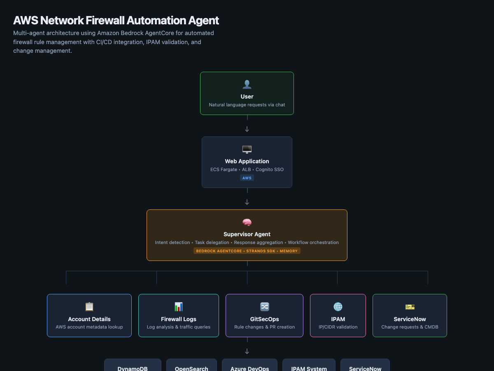
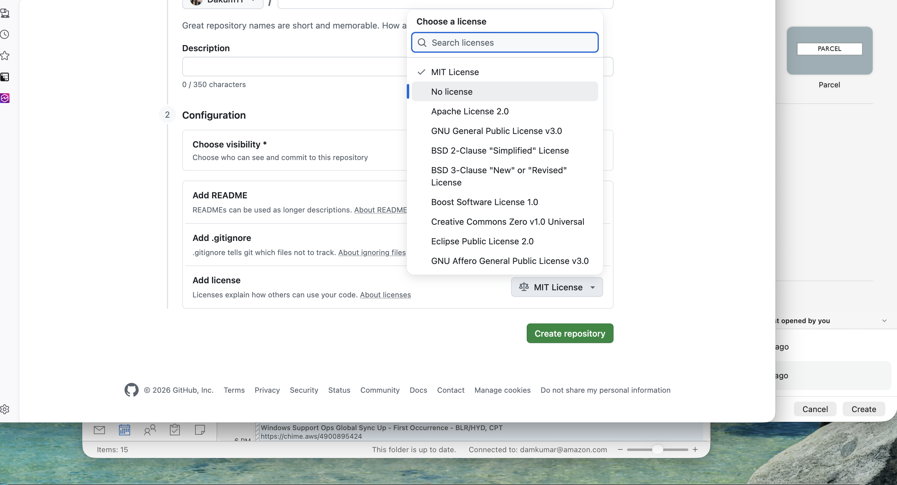

# Guidance for Automated Network Firewall Rule Management using Amazon Bedrock AgentCore on AWS

## Table of Contents

1. [Overview](#overview)
    - [Cost](#cost)
2. [Prerequisites](#prerequisites)
    - [Operating System](#operating-system)
    - [AWS account requirements](#aws-account-requirements)
    - [IAM Role Setup](#iam-role-setup)
    - [Web Application Prerequisites (Optional)](#web-application-prerequisites-optional)
    - [Service quotas](#service-quotas)
    - [Supported Regions](#supported-regions)
3. [Setting Up Optional Integrations](#setting-up-optional-integrations)
    - [ServiceNow Integration Setup (from scratch)](#servicenow-integration-setup-from-scratch)
    - [Azure DevOps Integration Setup (from scratch)](#azure-devops-integration-setup-from-scratch)
    - [IPAM Integration Setup](#ipam-integration-setup)
    - [Networking gotchas for AgentCore (VPC configuration)](#networking-gotchas-for-agentcore-vpc-configuration)
4. [Deployment Steps](#deployment-steps)
5. [Deployment Validation](#deployment-validation)
6. [Running the Guidance](#running-the-guidance)
7. [Next Steps](#next-steps)
8. [Cleanup](#cleanup)

## Overview

This Guidance demonstrates how to build and deploy a multi-agent system that automates AWS Network Firewall rule management using Amazon Bedrock AgentCore and the Strands Agents SDK. Five specialist agents collaborate to validate, author, and deploy firewall rule changes through natural language — removing manual toil while preserving approval gates.

**Why did we build this Guidance?** Managing AWS Network Firewall rules at scale requires specialized knowledge of Suricata rule syntax, IP address management, Git workflows, and change management processes. This Guidance solves the problem of manual, error-prone firewall rule authoring by orchestrating multiple AI agents that each handle a specific domain.

**What problem does this Guidance solve?**

- Eliminates manual Suricata rule authoring — natural-language requests are translated into validated rules, reducing misconfiguration risk
- Automates the end-to-end workflow from request through IP validation, rule generation, Git commit, PR creation, and change ticketing
- Provides multi-agent specialization so each domain (account context, log analysis, IPAM, Git, ITSM) is handled by a purpose-built agent
- Preserves approval gates — automation handles everything *except* the human approval step, keeping change control intact



### Architecture Flow

1. **User Interface**: Web application hosted on Amazon ECS Fargate behind an Application Load Balancer, with authentication through Amazon Cognito federated with Azure AD
2. **API Layer**: Amazon Bedrock AgentCore `InvokeAgentRuntime` API provides streaming chat interactions between the UI and the agent
3. **Supervisor Agent**: Central orchestrator built with Strands Agents SDK running on Bedrock AgentCore, using Claude Sonnet for intent detection, task delegation, and response aggregation
4. **Specialist Agents**: Five tool-based agents handle specific domains:
    - **Account Details Agent**: Retrieves AWS account metadata from DynamoDB via cross-account role assumption
    - **Firewall Logs Agent**: Queries OpenSearch for alert, flow, and TLS firewall logs to provide traffic context
    - **GitSecOps Agent**: Clones repos, creates branches, commits Suricata rule changes, and creates pull requests via Azure DevOps REST API
    - **IPAM Agent**: Validates IP addresses and CIDR blocks against enterprise IPAM (EfficientIP SOLIDserver)
    - **ServiceNow Agent**: Creates change requests and queries the CMDB for approval workflows
5. **Conversation Memory**: Amazon Bedrock AgentCore Memory provides persistent multi-turn context across sessions
6. **AI/ML Services**: Amazon Bedrock with Claude Sonnet 4 (via cross-region inference profile) for natural language processing and reasoning

### Cost

*You are responsible for the cost of the AWS services used while running this Guidance. As of August 2025, the cost for running this Guidance with the default settings in the US East (N. Virginia) region is approximately $265 per month for processing 1,000 conversations.*

*We recommend creating a [Budget](https://docs.aws.amazon.com/cost-management/latest/userguide/budgets-managing-costs.html) through [AWS Cost Explorer](https://aws.amazon.com/aws-cost-management/aws-cost-explorer/) to help manage costs. Prices are subject to change. For full details, refer to the pricing webpage for each AWS service used in this Guidance.*

### Sample Cost Table

The following table provides a sample cost breakdown for deploying this Guidance with the default parameters in the US East (N. Virginia) Region for one month.

| AWS service | Dimensions | Cost [USD] |
|---|---|---|
| Amazon Bedrock (Claude Sonnet 4) | ~1,000 conversations × 2,000 tokens avg | $50–$150 |
| Amazon Bedrock AgentCore | 1 runtime + 1 endpoint | $0 (preview) |
| Amazon ECS Fargate | 0.5 vCPU, 1 GB RAM (web UI) | $15 |
| Application Load Balancer | 1 ALB + data processing | $20 |
| Amazon Cognito | Up to 50,000 MAUs | $0 (free tier) |
| Amazon DynamoDB | On-demand, <1 GB storage | $1 |
| Amazon OpenSearch Serverless | 1 collection (if self-hosted) | $175 |
| Amazon ECR | <5 GB image storage | $0.50 |
| AWS Secrets Manager | 3–5 secrets | $2 |
| **Total** | | **~$265/month** |

> **Note:** Costs vary based on conversation volume, Bedrock model usage, and whether you use existing OpenSearch/IPAM infrastructure. AgentCore pricing may change after preview period.

## Prerequisites

### Operating System

These deployment instructions are optimized to best work on **Amazon Linux 2023 AMI**, **macOS**, or **Ubuntu 20.04+**. Deployment on other operating systems may require additional steps.

**Required tools:**

- Python 3.11+ ([installation guide](https://www.python.org/downloads/))
- uv 0.4+ ([installation guide](https://docs.astral.sh/uv/getting-started/installation/))
- Docker 24.0+ ([installation guide](https://docs.docker.com/get-docker/))
- AWS CLI v2.15+ ([installation guide](https://docs.aws.amazon.com/cli/latest/userguide/getting-started-install.html))
- Git ([installation guide](https://git-scm.com/downloads))

**Installation commands:**

```bash
# Install AWS CLI (Linux/macOS)
curl "https://awscli.amazonaws.com/awscli-exe-linux-x86_64.zip" -o "awscliv2.zip"
unzip awscliv2.zip && sudo ./aws/install

# Install uv (Python package manager)
curl -LsSf https://astral.sh/uv/install.sh | sh

# Install Docker (macOS)
brew install --cask docker

# Install Docker (Linux)
sudo apt-get update && sudo apt-get install docker.io
```

### AWS account requirements

- AWS account with permissions to create IAM roles, ECR repositories, ECS services, and Bedrock AgentCore resources
- Amazon Bedrock model access enabled for Claude Sonnet 4 (`us.anthropic.claude-sonnet-4-20250514-v1:0`)
- A VPC with private subnets and NAT gateway for AgentCore networking
- Security group allowing outbound HTTPS (port 443) for AgentCore runtime
- **IAM execution role** for Bedrock AgentCore (see [IAM Role Setup](#iam-role-setup) below)
- (Optional) Azure DevOps organization with a repository containing firewall rules
- (Optional) Enterprise IPAM system (EfficientIP SOLIDserver) credentials stored in AWS Secrets Manager
- (Optional) OpenSearch domain or serverless collection for firewall log queries
- (Optional, for web application) A registered domain name with a Route 53 hosted zone (see [Web Application Prerequisites](#web-application-prerequisites-optional))

### IAM Role Setup

Create the IAM execution role for AgentCore **before** running the deployment scripts. The agent runtime needs this role to pull container images, invoke Bedrock models, and write logs.

```bash
# Create the IAM role with Bedrock AgentCore trust policy
aws iam create-role \
  --role-name FirewallAutomation-AgentCore-Execution-Role \
  --assume-role-policy-document '{
    "Version": "2012-10-17",
    "Statement": [{
      "Effect": "Allow",
      "Principal": {"Service": "bedrock-agentcore.amazonaws.com"},
      "Action": "sts:AssumeRole",
      "Condition": {
        "StringEquals": {"aws:SourceAccount": "<ACCOUNT_ID>"},
        "ArnLike": {"aws:SourceArn": "arn:aws:bedrock-agentcore:<REGION>:<ACCOUNT_ID>:*"}
      }
    }]
  }'

# Attach permissions (replace <ACCOUNT_ID> and <REGION> with your values)
aws iam put-role-policy \
  --role-name FirewallAutomation-AgentCore-Execution-Role \
  --policy-name AgentPermissions \
  --policy-document '{
    "Version": "2012-10-17",
    "Statement": [
      {
        "Sid": "BedrockModelInvocation",
        "Effect": "Allow",
        "Action": [
          "bedrock:InvokeModel",
          "bedrock:InvokeModelWithResponseStream"
        ],
        "Resource": [
          "arn:aws:bedrock:*::foundation-model/anthropic.*",
          "arn:aws:bedrock:<REGION>:<ACCOUNT_ID>:inference-profile/us.anthropic.*"
        ]
      },
      {
        "Sid": "ECRImageAccess",
        "Effect": "Allow",
        "Action": [
          "ecr:GetDownloadUrlForLayer",
          "ecr:BatchGetImage"
        ],
        "Resource": "arn:aws:ecr:<REGION>:<ACCOUNT_ID>:repository/firewall-automation-agent"
      },
      {
        "Sid": "ECRTokenAccess",
        "Effect": "Allow",
        "Action": "ecr:GetAuthorizationToken",
        "Resource": "*"
      },
      {
        "Sid": "CloudWatchLogs",
        "Effect": "Allow",
        "Action": [
          "logs:CreateLogGroup",
          "logs:CreateLogStream",
          "logs:PutLogEvents",
          "logs:DescribeLogStreams",
          "logs:DescribeLogGroups"
        ],
        "Resource": "arn:aws:logs:<REGION>:<ACCOUNT_ID>:log-group:/aws/bedrock-agentcore/runtimes/*"
      },
      {
        "Sid": "SecretsManagerAccess",
        "Effect": "Allow",
        "Action": "secretsmanager:GetSecretValue",
        "Resource": "arn:aws:secretsmanager:<REGION>:<ACCOUNT_ID>:secret:firewall-automation/*"
      },
      {
        "Sid": "DynamoDBAccess",
        "Effect": "Allow",
        "Action": [
          "dynamodb:GetItem",
          "dynamodb:Query",
          "dynamodb:Scan"
        ],
        "Resource": "arn:aws:dynamodb:<REGION>:<ACCOUNT_ID>:table/account-metadata"
      },
      {
        "Sid": "AgentCoreWorkloadIdentity",
        "Effect": "Allow",
        "Action": [
          "bedrock-agentcore:GetWorkloadAccessToken",
          "bedrock-agentcore:GetWorkloadAccessTokenForJWT",
          "bedrock-agentcore:GetWorkloadAccessTokenForUserId"
        ],
        "Resource": [
          "arn:aws:bedrock-agentcore:<REGION>:<ACCOUNT_ID>:workload-identity-directory/default",
          "arn:aws:bedrock-agentcore:<REGION>:<ACCOUNT_ID>:workload-identity-directory/default/workload-identity/agentName-*"
        ]
      },
      {
        "Sid": "Observability",
        "Effect": "Allow",
        "Action": [
          "xray:PutTraceSegments",
          "xray:PutTelemetryRecords",
          "xray:GetSamplingRules",
          "xray:GetSamplingTargets"
        ],
        "Resource": "*"
      },
      {
        "Sid": "CloudWatchMetrics",
        "Effect": "Allow",
        "Action": "cloudwatch:PutMetricData",
        "Resource": "*",
        "Condition": {
          "StringEquals": {"cloudwatch:namespace": "bedrock-agentcore"}
        }
      }
    ]
  }'
```

> **Note:** Only `ecr:GetAuthorizationToken`, X-Ray, and CloudWatch Metrics require `Resource: "*"` — this is mandated by AWS. All other permissions are scoped to specific resource ARNs.

### Web Application Prerequisites (Optional)

If you plan to deploy the web application (Step 6), you'll need:

- **Domain name**: A registered domain name (e.g., `firewall-agent.example.com`)
- **Route 53 hosted zone**: A hosted zone ID for your domain to create DNS records and validate SSL certificates
- **Azure AD application**: A registered Azure AD application for Cognito SSO federation (tenant ID, client ID, client secret)

These are only required for the production web UI deployment. You can skip this and use local development mode (Step 7) instead.

### Service quotas

| Service | Default quota | Required |
|---|---|---|
| Amazon Bedrock AgentCore Runtimes | 5 per region | 1 |
| Amazon ECS Fargate tasks | 50 per region | 1 |
| Amazon ECR repositories | 10,000 per region | 1 |
| AWS Secrets Manager secrets | 500,000 per region | 3–5 |

### Supported Regions

This Guidance uses Amazon Bedrock AgentCore and Claude Sonnet 4 cross-region inference. It is supported in the following regions:

- US East (N. Virginia) — `us-east-1`
- US West (Oregon) — `us-west-2`

## Setting Up Optional Integrations

The specialist agents talk to external systems (ServiceNow, Azure DevOps, an enterprise IPAM). If you already run these systems, just supply credentials. If you **don't** have them, the sections below walk you through standing up **free developer/test instances** so you can exercise the full workflow end to end. Each agent degrades gracefully: an unconfigured backend logs a warning and disables just that agent's tools, so you can set these up one at a time.

Credentials are read from **AWS Secrets Manager** (with an environment-variable fallback for ServiceNow) — never hardcode them (this repository is public). The pattern is: create a secret, then point the agent at it via environment variables.

### ServiceNow Integration Setup (from scratch)

The ServiceNow agent (`agent/src/subagent/servicenow_agent.py`) creates and queries **change requests** and browses the **service catalog** via the ServiceNow REST Table API using HTTP Basic authentication.

**How the agent resolves ServiceNow config (matches the code):**

- `SERVICENOW_INSTANCE` — the instance base URL, e.g. `https://devXXXXXX.service-now.com` (environment variable).
- `SERVICENOW_SECRET_NAME` — Secrets Manager secret holding `{"username": "...", "password": "..."}` (default `servicenow/credentials`). If the secret is absent, the agent falls back to the `SERVICENOW_USERNAME` / `SERVICENOW_PASSWORD` environment variables.
- The secret is read in the region from `AWS_REGION` (default `us-east-1`), so make sure the secret lives in the region the agent runs in.

#### 1. Get a free ServiceNow Personal Developer Instance (PDI)

1. Sign up at [developer.servicenow.com](https://developer.servicenow.com) (free).
2. From the top-right menu, choose **Manage → Instance → Request Instance**. Provisioning takes ~5 minutes.
3. You'll receive an instance URL like `https://devXXXXXX.service-now.com` plus an `admin` username and password. A PDI ships pre-loaded with sample `change_request`, `sc_cat_item`, and `sc_category` data — ideal for testing.

> PDIs hibernate after ~10 days of inactivity; wake them from the developer portal before testing.

#### 2. Create a dedicated integration user (recommended over `admin`)

Using a service account keeps the demo isolated and avoids MFA friction on the `admin` account.

1. Open the Users list: `https://devXXXXXX.service-now.com/nav_to.do?uri=sys_user_list.do` → **New**.
2. Set **User ID** = `svc_firewall_agent`, a first/last name, and a **password with no special characters** (avoids URL/shell-escaping issues), e.g. `LabTest12345Abcd`.
3. **Uncheck** "Password needs reset" and ensure **"Enable Multifactor Authentication" is unchecked**; set **Active** = checked.
4. Save, reopen the user, scroll to the **Roles** related list → **Edit**, and add:
   - `admin` (simplest for a lab), or least-privilege `itil` + `catalog`, **AND**
   - **`snc_basic_auth_api_access`** — **required** (see gotcha below).

#### 3. Enable REST Basic auth for the integration user (critical gotcha)

Modern ServiceNow instances ship with the **"Basic Auth — API Access Restriction"** feature enforced (property `glide.authenticate.basic_auth.restriction.enforce = true`). With it on, **only users holding the `snc_basic_auth_api_access` role may authenticate to the REST API with Basic auth** — everyone else receives `HTTP 401 "User is not authenticated"` on *every* endpoint, identically whether or not credentials are sent (the request is rejected before the user is even evaluated).

- **Symptom:** REST calls return 401 for every user and endpoint, but the same credentials log in fine through the web UI.
- **Fix:** grant the `snc_basic_auth_api_access` role to your integration user (step 2.4). No instance-wide property change is required.

Also verify **IP Address Access Control** (All → search "IP Address Access Control") is empty/disabled, or contains an **inbound Allow** rule that includes your egress IP — a default-deny with no allow rules also blocks all REST traffic.

#### 4. Store the credentials in Secrets Manager

Create a secret containing `username` and `password` (the instance URL is passed separately via `SERVICENOW_INSTANCE`), without exposing the password on the command line:

```bash
python3 - > /tmp/snow_secret.json <<'PY'
import json, getpass
print(json.dumps({
    "username": "svc_firewall_agent",
    "password": getpass.getpass("ServiceNow password: "),
}))
PY

aws secretsmanager create-secret \
  --name "servicenow/credentials" \
  --description "ServiceNow credentials for the firewall automation ServiceNow agent" \
  --secret-string "file:///tmp/snow_secret.json" \
  --region us-east-1

rm -f /tmp/snow_secret.json
```

Then set the instance URL (and, if you use a non-default secret name, `SERVICENOW_SECRET_NAME`) as environment variables — in `.env` for local dev, or as runtime environment variables at deploy time:

```
SERVICENOW_INSTANCE=https://devXXXXXX.service-now.com
# SERVICENOW_SECRET_NAME=servicenow/credentials   # default; override if you named it differently
```

The AgentCore execution role already grants `secretsmanager:GetSecretValue`.

#### 5. Verify the integration (before deploying)

Confirm connectivity and that the role fix worked by calling the Table API directly:

```bash
SNOW_INSTANCE="https://devXXXXXX.service-now.com"
SNOW_USER="svc_firewall_agent"
read -rs SNOW_PW; echo   # reads the password without echoing it
curl -s -u "$SNOW_USER:$SNOW_PW" \
  "$SNOW_INSTANCE/api/now/table/change_request?sysparm_limit=3&sysparm_fields=number,short_description" \
  -H "Accept: application/json"
```

A JSON list of change requests confirms success. `HTTP 401` means the `snc_basic_auth_api_access` role or IP Access Control still needs attention (see the gotcha above).

### Azure DevOps Integration Setup (from scratch)

The GitSecOps agent (`agent/src/subagent/gitops_tools.py`) clones a repo, commits Suricata rule changes, and opens pull requests via the Azure DevOps REST API. (A GitHub variant is available under `notebooks/gitops-agent/` — see [Next Steps](#next-steps) to swap providers.)

1. Create a free organization at [dev.azure.com](https://dev.azure.com) using any Microsoft account.
2. Create a project (e.g. `NetworkFirewall`).
3. Initialize a Git repo in that project and add a rules file — you can seed it from `sample-data/suricata-rules-example.rules`.
4. Generate a **Personal Access Token (PAT)**: user settings → **Personal Access Tokens → New Token**, with scopes **Code (Read & Write)** and **Pull Request Threads (Read & Write)**.
5. Store the PAT in Secrets Manager (format `{"username": "...", "password": "<PAT>"}`):

   ```bash
   aws secretsmanager create-secret \
     --name "firewall-automation/azure-devops/pat" \
     --secret-string '{"username": "your-email@example.com", "password": "<YOUR_PAT>"}' \
     --region us-east-1
   ```
6. Set these environment variables (in `.env` for local, or as runtime env vars at deploy): `AZURE_DEVOPS_ORG`, `AZURE_DEVOPS_PROJECT`, `REPO_NAME`, and `AZURE_DEVOPS_SECRET_NAME` (default `firewall-automation/azure-devops/pat`).

### IPAM Integration Setup

The IPAM agent validates IPs/CIDRs against an enterprise IPAM (EfficientIP SOLIDserver by default). If you don't run one, leave `IPAM_SECRET_NAME` unset — the agent disables IP-validation tools and continues. To connect one, store `{"username": "...", "password": "...", "ipam_url": "https://..."}` in Secrets Manager and set `IPAM_SECRET_NAME` (default `ipam/credentials`; see `agent/src/utils/ipam_utils.py` to target a different IPAM product).

### Networking gotchas for AgentCore (VPC configuration)

When you deploy the AgentCore runtime with `networkMode: VPC`, the subnets and security groups must satisfy **all** of the following, or the update fails:

- **Same VPC:** every subnet and security group must belong to the *same* VPC (mixing VPCs fails with `SubnetsAndSecurityGroupsInDifferentVpc`).
- **Supported Availability Zone:** the subnet's AZ must be one AgentCore supports in your account (a failed update names the supported AZ **IDs**, e.g. `use1-az1/az2/az4`). Map AZ names to IDs with `aws ec2 describe-availability-zones --query 'AvailabilityZones[].{Name:ZoneName,Id:ZoneId}'`.
- **Egress to the internet:** the agent must reach Bedrock and your integrations, so use a **private subnet with a NAT gateway route** (`0.0.0.0/0 → nat-...`) or a public subnet with an internet gateway. Confirm the security group allows outbound `443`.

## Deployment Steps

### Step 1: Clone the repository

```bash
git clone https://github.com/Dakum11/sample-network-firewall-automation-agent.git
cd sample-network-firewall-automation-agent
```

### Step 2: Configure environment variables

```bash
cp .env.example .env
```

Edit `.env` with your values. Key variables:

| Variable | Description |
|---|---|
| `AWS_REGION` | AWS region (default: `us-east-1`) |
| `BEDROCK_MODEL_ID` | Inference profile ID: `us.anthropic.claude-sonnet-4-20250514-v1:0` |
| `AGENT_SUBNETS` | Comma-separated private subnet IDs |
| `AGENT_SECURITY_GROUPS` | Comma-separated security group IDs |
| `ECR_REPOSITORY` | ECR repository URI for the agent container |

See [.env.example](.env.example) for the full list of configuration options.

### Step 3: Create the ECR repository

```bash
aws ecr create-repository \
  --repository-name firewall-automation-agent \
  --region us-east-1
```

### Step 4: Build and push the agent container

```bash
cd agent/src
uv sync
docker build -t firewall-automation-agent:latest .

# Authenticate with ECR
aws ecr get-login-password --region us-east-1 | \
  docker login --username AWS --password-stdin <ACCOUNT_ID>.dkr.ecr.us-east-1.amazonaws.com

# Tag and push
docker tag firewall-automation-agent:latest \
  <ACCOUNT_ID>.dkr.ecr.us-east-1.amazonaws.com/firewall-automation-agent:latest
docker push \
  <ACCOUNT_ID>.dkr.ecr.us-east-1.amazonaws.com/firewall-automation-agent:latest

cd ../..
```

### Step 5: Deploy the AgentCore runtime

The deployment script builds the container image, pushes it to ECR, and creates/updates your Bedrock AgentCore runtime. Configuration is loaded automatically from your `.env` file (created in Step 2).

**Prerequisites for this step:**
- IAM execution role created (see [IAM Role Setup](#iam-role-setup) in Prerequisites above)
- VPC with private subnets and a NAT gateway
- Security group allowing outbound HTTPS (port 443)

#### Option A: First-time deployment (create a new runtime)

```bash
cd agent
./deploy.sh --create
cd ..
```

The script will:
1. Build and push the Docker image to ECR
2. Call `CreateAgentRuntime` to provision a new runtime
3. Wait for the runtime to reach `READY` status
4. Print the **Runtime ID** — save this in your `.env` file as `AGENT_RUNTIME_ID`

#### Option B: Update an existing runtime

After your first deployment, set `AGENT_RUNTIME_ID` in `.env` with the ID from Option A, then:

```bash
cd agent
./deploy.sh
cd ..
```

This updates the existing runtime with the new container image.

#### Option C: Run deploy.py directly (without the shell wrapper)

```bash
cd agent

# Create a new runtime
uv run deploy.py --create \
  --region us-east-1 \
  --account-id <ACCOUNT_ID> \
  --ecr-repository <ACCOUNT_ID>.dkr.ecr.us-east-1.amazonaws.com/firewall-automation-agent \
  --version 1.0.0 \
  --subnets <SUBNET_1>,<SUBNET_2> \
  --security-groups <SG_ID> \
  --role-name FirewallAutomation-AgentCore-Execution-Role \
  --runtime-name firewall_automation_agent

# Or update an existing runtime
uv run deploy.py --agent-runtime-id <RUNTIME_ID> \
  --region us-east-1 \
  --account-id <ACCOUNT_ID> \
  --ecr-repository <ACCOUNT_ID>.dkr.ecr.us-east-1.amazonaws.com/firewall-automation-agent \
  --version 1.0.1 \
  --subnets <SUBNET_1>,<SUBNET_2> \
  --security-groups <SG_ID> \
  --role-name FirewallAutomation-AgentCore-Execution-Role

cd ..
```

> **Note:** The IAM execution role must be created before this step. See [IAM Role Setup](#iam-role-setup) in Prerequisites. The optional environment variables (`AZURE_DEVOPS_ORG`, `AZURE_DEVOPS_PROJECT`, `REPO_NAME`, etc.) are passed to the runtime automatically if set in your `.env`. If you haven't configured the GitOps integration yet, the agent will still function — it logs a warning and disables those tools gracefully.

### Step 5.5: Build and push the web application image

> **Important:** The web application (`app/`) is a **separate container image** from the agent runtime (`agent/`). The agent image runs the Bedrock AgentCore agent (entrypoint `python -m agent`); the web app image runs the Flask UI with gunicorn on port **8501**. Step 6 deploys the **web app image**, not the agent image — do not reuse `firewall-automation-agent` for the ECS service.

```bash
# Create a dedicated ECR repository for the web app
aws ecr create-repository \
  --repository-name firewall-automation-app \
  --region us-east-1

# Build the web app image
cd app

# NOTE: build for the CPU architecture your Fargate task uses.
# The app-template.yaml task definition sets RuntimePlatform.CpuArchitecture.
# On Apple Silicon / Graviton, build arm64; on Intel, build amd64.
docker build --platform linux/arm64 -t firewall-automation-app:latest .   # arm64 (Graviton/Apple Silicon)
# docker build --platform linux/amd64 -t firewall-automation-app:latest .  # amd64 (Intel)

# Authenticate with ECR
aws ecr get-login-password --region us-east-1 | \
  docker login --username AWS --password-stdin <ACCOUNT_ID>.dkr.ecr.us-east-1.amazonaws.com

# Tag and push
docker tag firewall-automation-app:latest \
  <ACCOUNT_ID>.dkr.ecr.us-east-1.amazonaws.com/firewall-automation-app:latest
docker push \
  <ACCOUNT_ID>.dkr.ecr.us-east-1.amazonaws.com/firewall-automation-app:latest

cd ..
```

> **Architecture must match:** the image architecture (`--platform`) must match `RuntimePlatform.CpuArchitecture` in `infra/cloudformation/app-template.yaml`. A mismatch causes the container to fail at startup with `exec format error` and the ECS task never becomes healthy.

### Step 6: Deploy the web application (CloudFormation)

> **Prerequisites:** This step requires a registered domain name and a Route 53 hosted zone. See [Web Application Prerequisites](#web-application-prerequisites-optional). If you don't have these, skip to Step 7 for local development.

```bash
aws cloudformation deploy \
  --template-file infra/cloudformation/app-template.yaml \
  --stack-name firewall-automation-app \
  --parameter-overrides \
    ProjectName=firewall-automation \
    VpcId=<YOUR_VPC_ID> \
    SubnetIds=<SUBNET_1>,<SUBNET_2> \
    ContainerImage=<ACCOUNT_ID>.dkr.ecr.us-east-1.amazonaws.com/firewall-automation-app:latest \
    WebConsoleRootDomainName=<YOUR_DOMAIN> \
    HostedZoneId=<YOUR_HOSTED_ZONE_ID> \
    AzureADTenantId=<YOUR_TENANT_ID> \
    AzureADClientId=<YOUR_CLIENT_ID> \
    AzureADClientSecret=<YOUR_CLIENT_SECRET> \
  --capabilities CAPABILITY_NAMED_IAM
```

### Step 7 (Alternative): Run locally for development

```bash
cd app
uv sync
LOCAL_DEV=true uv run python app.py
```

The application will be available at `http://localhost:8501`.

## Deployment Validation

1. **Verify AgentCore runtime status**:

    ```bash
    aws bedrock-agentcore-control get-agent-runtime \
      --agent-runtime-id <RUNTIME_ID> \
      --region us-east-1 \
      --query 'status'
    ```

    Expected output: `"READY"`

2. **Verify AgentCore endpoint status**:

    ```bash
    aws bedrock-agentcore-control get-agent-runtime-endpoint \
      --agent-runtime-id <RUNTIME_ID> \
      --endpoint-name <ENDPOINT_NAME> \
      --region us-east-1 \
      --query 'status'
    ```

    Expected output: `"READY"`

3. **Verify ECR image exists**:

    ```bash
    aws ecr describe-images \
      --repository-name firewall-automation-agent \
      --region us-east-1 \
      --query 'imageDetails[0].imageTags'
    ```

    Expected output: `["latest"]`

4. **Verify CloudFormation stack** (if deployed):

    Open the AWS CloudFormation console and confirm the `firewall-automation-app` stack shows `CREATE_COMPLETE` status.

5. **Verify ECS service** (if deployed):

    ```bash
    aws ecs describe-services \
      --cluster firewall-automation \
      --services firewall-automation-app \
      --region us-east-1 \
      --query 'services[0].status'
    ```

    Expected output: `"ACTIVE"`

## Running the Guidance

### Accessing the Application

1. Open the web application URL (from CloudFormation outputs or `http://localhost:8501` for local development)
2. Sign in with your Azure AD credentials (Cognito SSO) or use the local development mode
3. Start a new conversation in the chat interface

### Sample Interactions

**Firewall Rule Creation:**

```
Input: "Create a firewall rule to block inbound traffic from 203.0.113.0/24 to our production 
subnet on port 443"

Expected Output: The agent validates the IP range against IPAM, generates a Suricata rule, 
creates a Git branch, commits the rule, and opens a pull request for approval.
```

**Log Analysis:**

```
Input: "Show me the top blocked connections from the last 24 hours for account 123456789012"

Expected Output: The agent queries OpenSearch for firewall alert logs, retrieves account 
metadata from DynamoDB, and presents a summary of blocked traffic with source IPs, 
destination ports, and rule matches.
```

**IP Validation:**

```
Input: "Is 10.50.2.100 a valid IP in our IPAM for the Sydney production environment?"

Expected Output: The agent queries the IPAM system and returns the IP allocation status, 
associated subnet, and whether the address is available or already assigned.
```

**Multi-step Workflow:**

```
Input: "I need to allow HTTPS traffic from 10.0.1.0/24 to 10.0.2.0/24 for account 
ACME-Production. Please create the rule and raise a change request."

Expected Output: The agent:
1. Looks up account metadata
2. Validates both CIDR blocks in IPAM
3. Generates the Suricata allow rule
4. Commits to a feature branch and creates a PR
5. Creates a ServiceNow change request linked to the PR
```

### Expected Output Features

- **Streaming responses**: Messages appear in real-time as the agent processes
- **Tool transparency**: The UI shows which tools the agent invokes (account lookup, IPAM validation, etc.)
- **Multi-turn context**: Conversation history is maintained via AgentCore Memory across sessions
- **Graceful degradation**: Unconfigured backends (IPAM, ServiceNow, Azure DevOps) produce warnings rather than failures



## Next Steps

**Customization Options:**

1. **Swap Git providers**: Replace Azure DevOps tools in `agent/src/subagent/gitops_tools.py` with GitHub or GitLab API calls. The supervisor agent routes by tool name, so no orchestration changes are needed.

2. **Add new specialist agents**: Create a new `@tool`-decorated function in `agent/src/subagent/` or `agent/src/utils/`, register it in the tools list in `agent/src/agent.py`, and the supervisor will automatically discover it.

3. **Customize IPAM backend**: Update `agent/src/utils/ipam_utils.py` to target your IPAM system. Store credentials in Secrets Manager under the key specified by `IPAM_SECRET_NAME`.

4. **Modify rule format**: Update the supervisor agent's system prompt in `agent/src/agent.py` to generate rules in your organization's specific format (the default is standard Suricata).

5. **Scale for production**: Increase ECS Fargate task size, enable auto-scaling, and configure CloudWatch alarms for monitoring.

6. **Explore the notebooks**: The `notebooks/` directory contains step-by-step development guides for each individual agent (account-details, firewall-logs, gitops, IPAM, monitoring, and AgentCore identity setup).

## Cleanup

### Delete CloudFormation stack (web application)

```bash
aws cloudformation delete-stack --stack-name firewall-automation-app
```

### Delete AgentCore resources

```bash
# Delete endpoint
aws bedrock-agentcore-control delete-agent-runtime-endpoint \
  --agent-runtime-id <RUNTIME_ID> \
  --endpoint-name <ENDPOINT_NAME> \
  --region us-east-1

# Delete runtime
aws bedrock-agentcore-control delete-agent-runtime \
  --agent-runtime-id <RUNTIME_ID> \
  --region us-east-1

# Delete memory (if created)
aws bedrock-agentcore-control delete-memory \
  --memory-id <MEMORY_ID> \
  --region us-east-1
```

### Delete ECR repository

```bash
aws ecr delete-repository \
  --repository-name firewall-automation-agent \
  --region us-east-1 \
  --force
```

### Delete IAM role

```bash
aws iam delete-role-policy \
  --role-name FirewallAutomation-AgentCore-Execution-Role \
  --policy-name AgentPermissions

aws iam delete-role \
  --role-name FirewallAutomation-AgentCore-Execution-Role
```

## Security

See [CONTRIBUTING](CONTRIBUTING.md#security-issue-notifications) for more information.

## License

This library is licensed under the MIT-0 License. See the [LICENSE](LICENSE) file.
